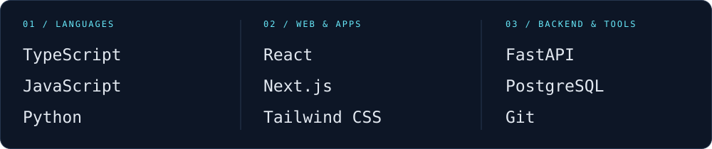
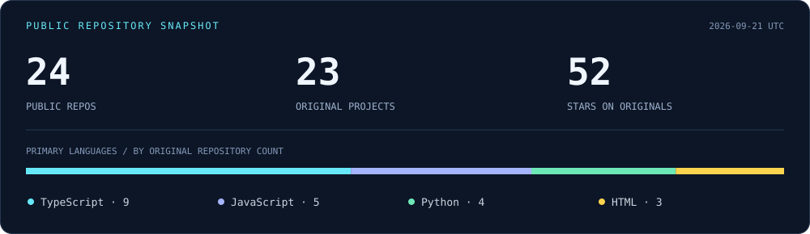

  

  <b>技术创业者 · 全栈开发者 · 网络安全探索者</b> 
  Building products, learning in public, and connecting the dots.

  <a href="https://neo.liguozheng.site"><b>个人网站 ↗</b></a> &nbsp; / &nbsp;
  <a href="#selected-work">代表作品</a> &nbsp; / &nbsp;
  <a href="https://neo.liguozheng.site/#journey">我的故事</a> &nbsp; / &nbsp;
  <a href="https://neo.liguozheng.site/#contact">联系我</a>

## 👋 About me / 关于我

你好，我是 **李国正（Neo / 正算法）**。从代码与网络安全出发，做过校园产品，也在创业和 AI 项目中继续摸索。我喜欢把想法做出来，再从真实使用中寻找下一步。

- 🛠️ **动手做产品**：从校园论坛、效率工具，到 AI 应用与交互式学习体验。
- 🚀 **创业实践**：2025 年成立灵衍未来，把技术探索延伸到产品、团队与协作。
- 🧠 **当前方向**：推进 SoulOS_Data_Center 的先导 MVP，探索个人数据与 AI 长期记忆；Sphere 是相关硬件方向的探索。
- 🌱 **持续学习**：全栈开发、Agent 工作流、网络安全与人机交互。

I'm a developer and founder exploring the space between **AI, useful software, and personal data**. This profile brings together my open-source experiments and the projects I'm building along the way.

## 🧭 My journey / 一路走来

| 阶段 | 经历与探索 |
| :--- | :--- |
| **2020–2021 · 代码起点** | 学习 C++、参与信息学竞赛，从兴趣走向动手实践。 |
| **2023–2024 · 校园产品** | 从高职论坛出发，经历产品开发、用户反馈与团队协作。 |
| **2024–2025 · 来到武汉** | 进入更大的技术与创业环境，成立灵衍未来。 |
| **2025–现在 · 个人 AI** | 围绕 SoulOS、个人数据与长期记忆持续构建，探索软硬件结合。 |

更多经历与项目背景，见 <a href="https://neo.liguozheng.site/#journey">个人网站</a>。

## 🧩 Selected work / 代表作品

<table>
<tr>
<td width="50%" valign="top">

### 🔐 Agent Vault
**Agent 之间的隐私与权限**

面向 A2A 交互的数字分身保险箱，探索身份认证、敏感信息过滤与交互审计。

Next.js · Python · FastAPI  
[查看项目 →](https://github.com/zhengsuanfa/agent-vault)

</td>
<td width="50%" valign="top">

### 🛡️ AI Cyber Sentinel
**AI × 网络安全学习**

围绕漏洞检测、攻防模拟与安全学习路径，探索更容易上手的网络安全实践。

TypeScript · AI · Security  
[查看项目 →](https://github.com/zhengsuanfa/AI-Cyber-Sentinel)

</td>
</tr>
<tr>
<td width="50%" valign="top">

### 🎮 OpenClaw 游戏化教学
**把安装教程变成闯关体验**

用关卡、XP 与逐步引导的代码片段，帮助使用者完成 OpenClaw 的安装与配置。

Next.js · shadcn/ui · 中英双语  
[查看项目 →](https://github.com/zhengsuanfa/openclaw_gamified_teaching)

</td>
<td width="50%" valign="top">

### 🧑‍⚖️ Hackathon Review
**AI 黑客松评审工作台**

从仓库与 Demo 链接出发，让不同职能的 AI 评委按赛道标准提供评审与反馈。

JavaScript · AI · Developer Tools  
[查看项目 →](https://github.com/zhengsuanfa/Hackathon_Review)

</td>
</tr>
<tr>
<td width="50%" valign="top">

### 🖼️ 豆包图片水印处理
**从一个具体问题做起**

为豆包 AI 生成图片提供水印处理工具，让重复的图片处理工作更方便。

Python · Image Processing  
[查看项目 →](https://github.com/zhengsuanfa/doubao-watermark-remover)

</td>
<td width="50%" valign="top">

### 📊 实习岗位数据分析
**从数据采集到可视化**

围绕抖音实习岗位进行数据采集与分析，用可视化整理岗位信息。

Python · Data · Visualization  
[查看项目 →](https://github.com/zhengsuanfa/douyin-intern-spider)

</td>
</tr>
</table>

  <a href="https://github.com/zhengsuanfa?tab=repositories">浏览全部公开仓库 ↗</a> &nbsp; · &nbsp;
  <a href="https://neo.liguozheng.site/#projects">更多产品与实践 ↗</a>

## 🧰 Toolbox / 常用技术

  

## 📡 On GitHub / 开源足迹

### 最近更新的公开项目

<!-- ACTIVITY:START -->
| 公开项目 | 最近推送（UTC） |
| :--- | :--- |
| [pingxing_jing](https://github.com/zhengsuanfa/pingxing_jing) | 2026-08-01 |
| [RBTI](https://github.com/zhengsuanfa/RBTI) | 2026-05-21 |
| [Hackathon_Review](https://github.com/zhengsuanfa/Hackathon_Review) | 2026-04-23 |
| [AI-Cyber-Sentinel](https://github.com/zhengsuanfa/AI-Cyber-Sentinel) | 2026-03-30 |
| [agent-vault](https://github.com/zhengsuanfa/agent-vault) | 2026-03-19 |
<!-- ACTIVITY:END -->

此区域由 GitHub Actions 每日同步公开仓库数据；语言按原创仓库的主要语言统计，不代表熟练度。日期使用 UTC。

---

  <b>Stay hungry. Stay foolish.</b>  
  对 AI 产品、开源工具或有意思的项目感兴趣？<a href="https://neo.liguozheng.site/#contact">来聊聊 ↗</a> 
  Layout inspired by <a href="https://github.com/Raymo111">Raymo111</a> · Built around my own journey.

